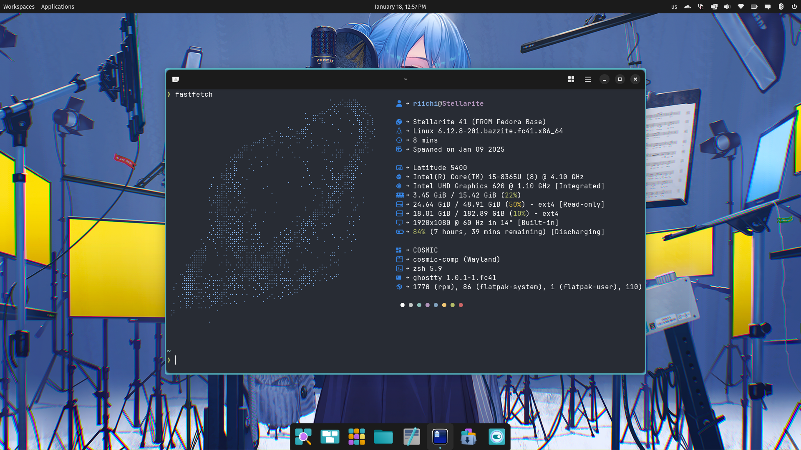
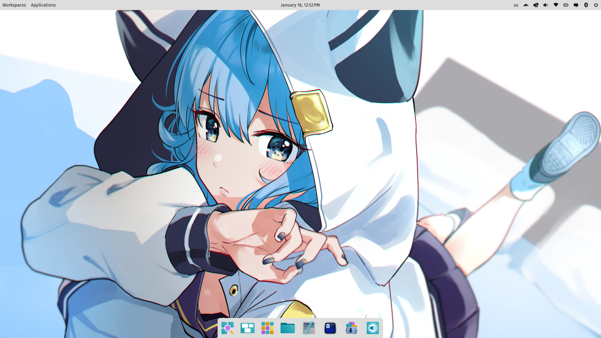
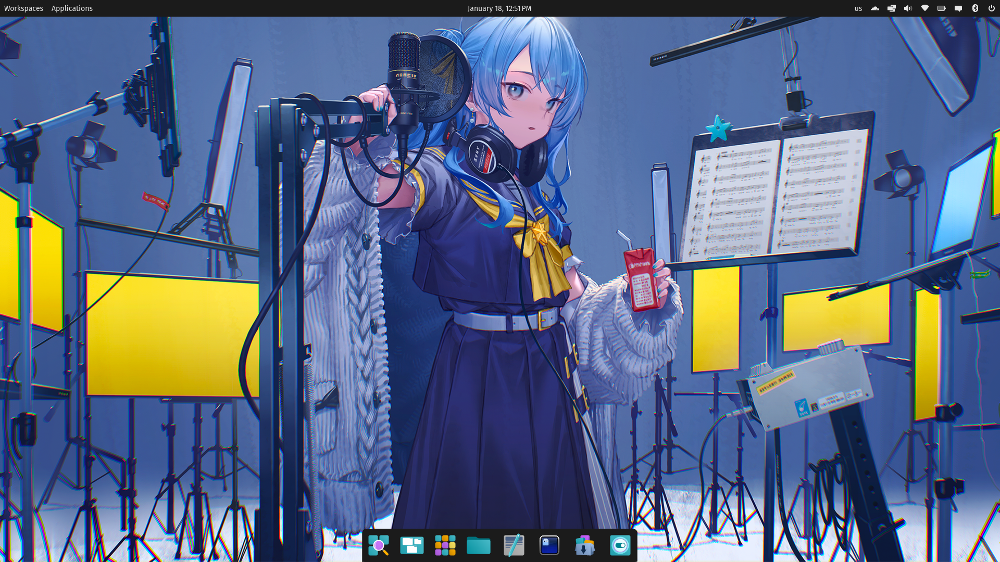

# Stellarite

[](https://artifacthub.io/packages/search?repo=stellarite) [](https://github.com/BillyAddlers/stellarite/actions/workflows/build.yml)

An opinionated Linux gaming distribution, powered by Fedora and Universal Blue.

> [!NOTE]
> These images are not associated with System76! If you have issues, please understand they might be COSMIC related, OR they might be related to this image.
> The COSMIC Desktop Environment is still ALPHA. Do not daily drive this image on your main workstation unless you know what you're doing.



## About

Stellarite is a custom Linux distribution designed to deliver an opinionated Fedora Atomic Image with the elegant and feature-rich COSMIC Desktop Environment preconfigured for a seamless out-of-the-box experience. This project aims to provide a refined system with carefully curated tweaks tailored to users seeking a polished, immutable desktop environment built on Fedora's cutting-edge technologies.

While Stellarite is open for use, building a custom image based on this project is not recommended due to the extensive modifications applied, which may complicate customization or troubleshooting. For a more lightweight and flexible base, we recommend exploring alternatives like [UBlue Base](https://github.com/ublue-os/main/pkgs/container/base-main), [Kinoite](https://github.com/ublue-os/main/pkgs/container/kinoite-main), or [Silverblue](https://github.com/ublue-os/main/pkgs/container/silverblue-main), which offer excellent starting points for custom Atomic setups.

<div align="center"><table><tr>Light or Dark? You Decide</tr><tr><td>
</td><td>
</td></tr></table></div>

<!--   -->

## What's Included

- **Solid OS Core**  
  Powered by the robust [ublue-os main](https://github.com/ublue-os/main), ensuring a reliable and stable base for your system.

- **Steam Preinstalled**  
  Shipped with [Steam](https://steamcommunity.com/) out of the box, ready for gaming enthusiasts to dive into their favorite titles.

- **COSMIC Desktop Environment**  
  Experience the sleek and powerful [COSMIC Desktop Environment](https://system76.com/cosmic/) by System76, providing a modern and intuitive user interface.

- **Bazzite Custom Kernel**  
  Includes the [Bazzite custom kernel](https://github.com/hhd-dev/kernel-bazzite) for enhanced performance and tailored optimizations.

- **Flatpak Preinstalled**  
  Flatpak is preconfigured for seamless access to a vast library of applications right from the start.

- **Brew Package Manager**  
  Comes with [Brew](https://brew.sh/) for easy management of additional software packages.

- **Waydroid Preinstalled**  
  Includes [Waydroid](https://waydroid.com/) to run Android apps and games directly on your desktop.

## Installation

> [!IMPORTANT]  
> **Download an ISO from the latest [Github Action Build Artifact](https://github.com/BillyAddlers/stellarite/actions/workflows/build_iso.yml). GitHub requires you be logged in to download.**

Rebase from an existing upstream Fedora Atomic to this image if you want **Open Source GPU Drivers**:
(Please note: Mesa's Open Source option for NVIDIA GPUs, NVK is still prone to errors at the time of writing, for any issues relating to NVK [please submit a report with Mesa](<[url](https://docs.mesa3d.org/bugs.html)>), not Stellarite)

```bash
rpm-ostree rebase ostree-unverified-registry:ghcr.io/billyaddlers/stellarite:stable
```

Nvidia Proprietary Variant coming soon!

**For users with Secure Boot enabled:** Follow Bazzite's [secure boot documentation](#secure-boot) prior to rebasing.

## Secure Boot

Secure Boot is enabled by default on our systems, adding an extra layer of security. During the initial installation, you will be prompted to enroll the secure boot key in the BIOS.

To enroll our key, enter the password `universalblue` when asked.

If this step is skipped during setup, you can manually enroll the key by running the following command in the terminal:

`ujust enroll-secure-boot-key`

Secure Boot works with Universal Blue's custom key, which can be found in the root of the akmods repository [here](https://github.com/ublue-os/akmods/raw/main/certs/public_key.der).
To enroll the key before installation or rebase, download the key and run:

```bash
sudo mokutil --timeout -1
sudo mokutil --import public_key.der

```

## Issues

For issues with the images, feel free to submit an issue on this repo. For COSMIC related issues, please see [cosmic-epoch/issues](https://github.com/pop-os/cosmic-epoch/issues).
